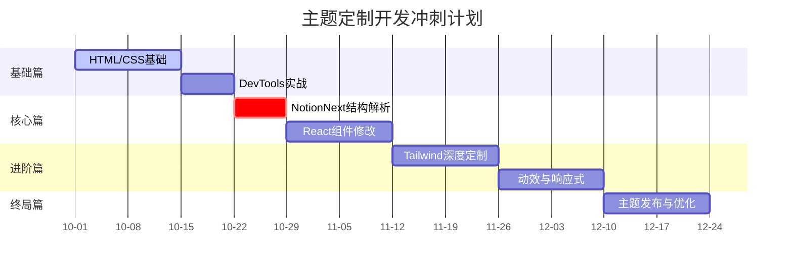

 **NotionNext主题定制速成路线**，按周分解的详细技术学习计划，结合 **倒推式时间管理法** 设计，助您最快在 **12周** 内实现主题自由：

---

### 🗓️ 总时间表（12周速成）


---

### 📌 周计划详解（每日学习1.5-2小时）

#### **第1-2周：HTML/CSS基础突击**
```markdown
# Week 1: HTML生存指南
## 每日任务（建议晚8-9点）
- Day1：安装VSCode + Chrome + Node.js
- Day2：学习HTML文档结构
  ```html
  <!DOCTYPE html>
  <html lang="zh-CN">
  <head>
    <meta charset="UTF-8">
    <title>我的博客</title>
  </head>
  <body>
    <div id="header"></div>
  </body>
  </html>
  ```
- Day3：使用Chrome审查元素定位博客标题
- Day4：修改`<h1>`标签内容测试效果
- Day5：理解块级/行内元素区别
- Day6：实战：在NotionNext中添加<div class="test-box">
- Day7：复习+问题整理

# Week 2: CSS核心突破
## 关键技术点
- 选择器优先级：`#header > .nav-item` 的权重计算
- 盒模型：`box-sizing: border-box` 的实际应用
- Flex布局：实现导航栏水平排列
- CSS变量：定义主题色`--primary-color: #3f51b5;`

## 实战任务
- 修改博客主色调（全局替换5处颜色）
- 调整文章卡片内边距`padding: 1.5rem`
- 实现导航栏Flex水平布局
```

#### **第3周：DevTools实战训练**
```markdown
# Week 3: 逆向工程训练
## 重点技能
1. 元素选择器定位：`⌘+Shift+C` 快速找到DOM节点
2. 样式调试技巧：
   - 实时修改数值：方向键微调`margin`值
   - 强制状态：`:hover` `:active`模拟交互
3. 控制台命令：
   ```js
   // 获取所有使用Flex布局的元素
   $$('*').filter(el => getComputedStyle(el).display === 'flex')
   ```

## 实战目标
- 找到文章标题的CSS类名并修改字体大小
- 隐藏不需要的侧边栏模块
- 导出修改后的CSS到本地文件
```

#### **第4周：NotionNext架构解析**
```markdown
# Week 4: 项目结构解剖
## 关键文件路径
```
/notionnext
├── components/
│   ├── Header.js      # 头部组件
│   └── Layout.js     # 全局布局
├── styles/
│   ├── global.css    # 基础样式
│   └── tailwind.css  # Tailwind入口
└── blog.config.js    # 主题配置
```

## 学习重点
1. 组件导入机制：`import Header from '@/components/Header'`
2. CSS Module使用：`import styles from './layout.module.css'`
3. 配置参数映射：`BLOG.theme`如何影响页面渲染

## 修改案例
- 在`Header.js`中添加自定义Logo图片
- 修改`global.css`中的`:root`变量
```

#### **第5-6周：React组件修改**
```markdown
# Week 5: JSX语法速成
## 核心概念
- 组件函数定义：
  ```jsx
  export default function Header({ title }) {
    return <h1>{title}</h1>
  }
  ```
- Props传递机制：父组件→子组件数据流
- 条件渲染：`{showNav && <Navigation />}`

## 实战任务
- 调整博客头部布局结构
- 添加自定义社交图标组件

# Week 6: 动态样式控制
## 关键技术
- 动态类名：`className={`btn ${isActive ? 'active' : ''}`}`
- 内联样式：`style={{ color: theme === 'dark' ? '#fff' : '#000' }}`
- 状态管理：`useState`控制暗黑模式切换

## 修改目标
- 实现主题色动态切换功能
- 添加移动端菜单展开/收起状态
```

#### **第7-8周：Tailwind深度定制**
```markdown
# Week 7: 工具类运用
## 重点工具类
- 布局：`grid grid-cols-3 gap-4`
- 间距：`p-4` `mt-8`
- 颜色：`text-primary-500 hover:text-primary-700`
- 响应式：`md:w-1/2`

## 配置扩展
修改`tailwind.config.js`：
```js
module.exports = {
  theme: {
    extend: {
      colors: {
        primary: '#3f51b5' // 自定义主题色
      }
    }
  }
}
```

# Week 8: 暗黑模式适配
## 实现步骤
1. 在`blog.config.js`添加`darkMode: true`
2. 使用Tailwind暗黑类：
   ```html
   <div className="dark:bg-gray-900 bg-white">
   ```
3. 添加模式切换按钮：
   ```jsx
   <button onClick={() => setDarkMode(!darkMode)}>
     {darkMode ? '🌞' : '🌙'}
   </button>
   ```

## 预期成果
- 实现一键切换暗黑/明亮模式
- 所有组件颜色自动适配当前主题
```

#### **第9-10周：动效与响应式**
```markdown
# Week 9: CSS过渡动画
## 关键代码
```css
.card {
  transition: all 0.3s cubic-bezier(0.4, 0, 0.2, 1);
}
.card:hover {
  transform: translateY(-4px);
  box-shadow: 0 10px 15px -3px rgba(0, 0, 0, 0.1);
}
```

## 实战应用
- 为文章卡片添加悬停放大效果
- 实现页面加载时的渐显动画

# Week 10: 移动端适配
## 媒体查询策略
```css
@media (max-width: 768px) {
  .nav-item {
    display: none;
  }
  .mobile-menu {
    display: block;
  }
}
```

## 修改目标
- 实现导航栏移动端折叠
- 优化文章页面的移动端阅读体验
```

#### **第11-12周：主题发布与优化**
```markdown
# Week 11: 样式优化
## 关键指标
- Lighthouse评分 > 90
- 首屏加载时间 < 1s
- 颜色对比度符合WCAG标准

## 优化手段
- 使用`next/image`优化图片
- 添加CSS Purge减少文件体积
- 实施字体子集化

# Week 12: 主题打包发布
## 发布流程
1. 创建主题配置文件`/themes/my-theme`
2. 提取可配置参数到`blog.config.js`
3. 编写使用文档`README.md`
4. 提交到NotionNext社区主题库

## 最终成果
- 拥有独特视觉风格的博客
- 可复用的自定义主题包
- 掌握前端基础开发能力
```

---

### 🛠️ 开发工具链
```markdown
1. **本地调试环境**
   ```bash
   git clone https://github.com/tangly1024/NotionNext
   cd NotionNext && npm install
   cp .env.example .env.local # 配置Notion密钥
   npm run dev
   ```

2. **VS Code扩展**
   - [Tailwind CSS IntelliSense](https://marketplace.visualstudio.com/items?itemName=bradlc.vscode-tailwindcss)
   - [CSS Modules](https://marketplace.visualstudio.com/items?itemName=clinyong.vscode-css-modules)
   - [React Refactor](https://marketplace.visualstudio.com/items?itemName=planbcoding.vscode-react-refactor)

3. **调试利器**
   - [React Developer Tools](https://chrome.google.com/webstore/detail/react-developer-tools/fmkadmapgofadopljbjfkapdkoienihi)
   - [JSON Formatter](https://chrome.google.com/webstore/detail/json-formatter/bcjindcccaagfpapjjmafapmmgkkhgoa)
```

---

### 📚 学习资源精选
```markdown
| 类型   | 名称                          | 链接                                                                 |
|--------|-------------------------------|----------------------------------------------------------------------|
| 文档   | NotionNext官方文档            | [链接](https://docs.tangly1024.com/)                                |
| 教程   | TailwindCSS实战30天           | [YouTube](https://www.youtube.com/watch?v=4wGmylafgW4)              |
| 工具   | CSS选择器速查表               | [速查表](https://frontend30.com/css-selectors-cheatsheet/)          |
| 社区   | NotionNext Discord频道        | [加入](https://discord.gg/4KZJ6kYVax)                              |
```

---

### 🚨 常见问题解决方案
```markdown
1. **样式修改不生效**
   - 检查CSS选择器优先级
   - 确认未开启浏览器缓存（Ctrl+Shift+R强制刷新）
   - 查看Tailwind的Purge配置是否过滤了必要类名

2. **组件渲染异常**
   - 使用React DevTools检查Props传递
   - 确认JSX闭合标签正确
   - 查看终端是否有编译错误

3. **移动端显示错乱**
   - 添加Viewport Meta标签
   ```html
   <meta name="viewport" content="width=device-width, initial-scale=1.0">
   ```
   - 使用Chrome设备模式调试
```

---

通过此计划，您将在 **每周看到明显的博客变化**，最终收获：
- 完全自定义的NotionNext主题
- 前端开发基础能力
- 工程化思维与实践经验
建议每周末进行 **成果演示**（截图存档），保持学习动力。遇到问题优先查阅官方文档，其次在Discord社区提问。